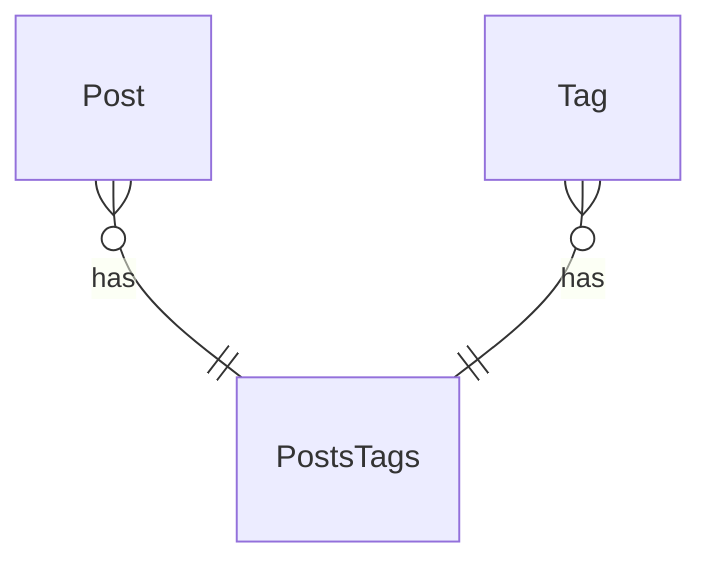

# EctoSync

**TLDR;**

Subscribe to events emitted by EctoWatch, cache the result, allow subscribers to sync.

## Use cases

### Schema



'Post' <-> 'PostsTags' <-> 'Tag'

### Subscribe to alterations of assocs of loaded rows (in a LiveView for example)

#### application.ex

```elixir
children = [
  ...,
  {EctoSync,
   repo: MyRepo,
   pub_sub: MyPubSub,
   watchers: EctoSync.all_events(Posts, assocs: true)
```

#### post_live.ex

```elixir
alias MyApp.Posts.Post
alias MyApp.Posts.Tag

def mount(params, session, socket) do
  posts = list_posts(preload: [:tags])
  if connected?(socket) do
    EctoSync.subscribe_all(Post)
  end

  {:ok, assign(socket, posts: posts)}
end

def handle_info({{Tag, _event}, sync_args}, socket) do
  {:ok, posts} = EctoSync.sync(socket.assigns.posts, sync_args)
  {:noreply, assign(socket, posts: posts)}
end
```

1. When a Tag is updated, all posts that contain that tag  will be updated.
2. When a Tag is inserted, the tag will automatically be added to the corresponding post.

The tag is loaded from the database once for each event handled by EctoSync.
The result is then cached and this cached version will be used when other processes call
`EctoSync.sync/2` with the args provided in `handle_info`.

### Subscribe to insertions of assocs that can be used for row creation

#### post_form.ex

```elixir
def mount(params, session, socket) do
  tags = list_tags()
  if connected?(socket) do
    EctoSync.subscribe_assocs(Post)
  end

  {:ok, assign(socket, tags: tags)}
end

def render(assigns) do
  ~F"""
  <.simple_form for={@form}>
    <input name="name" placeholder="Post name" />
    <select multiple name="tags">
      <option :for={tag <- @tags} value={tag.id}>{tag.name}</option>
    </select>
  </.simple_form>
  """
end

def handle_info({{Tag, _event}, sync_args}, socket) do
  {:ok, tags} = EctoSync.sync(socket.assigns.tags, sync_args)
  {:noreply, assign(socket, tags: tags)
end
```

## Installation

If [available in Hex](https://hex.pm/docs/publish), the package can be installed
by adding `ecto_sync` to your list of dependencies in `mix.exs`:

```elixir
def deps do
  [
    {:ecto_sync, "~> 0.1.0"}
  ]
end
```

### Modify lib/my_app/application.ex

```elixir
children = [
  ...,
  {EctoSync,
   repo: MyRepo,
   pub_sub: MyPubSub,
   watchers:
     EctoSync.all_events(Schema)
     |> EctoSync.all_events(OtherSchema, assocs: :some_assocs)
     |> EctoSync.all_events(AnotherSchema, extra_columns: [:test_id])},
  ]
```

Documentation can be generated with [ExDoc](https://github.com/elixir-lang/ex_doc)
and published on [HexDocs](https://hexdocs.pm). Once published, the docs can
be found at <https://hexdocs.pm/ecto_sync>.
